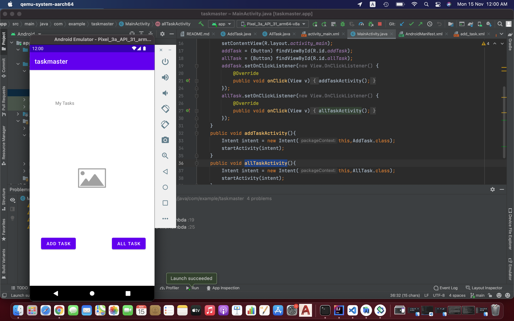
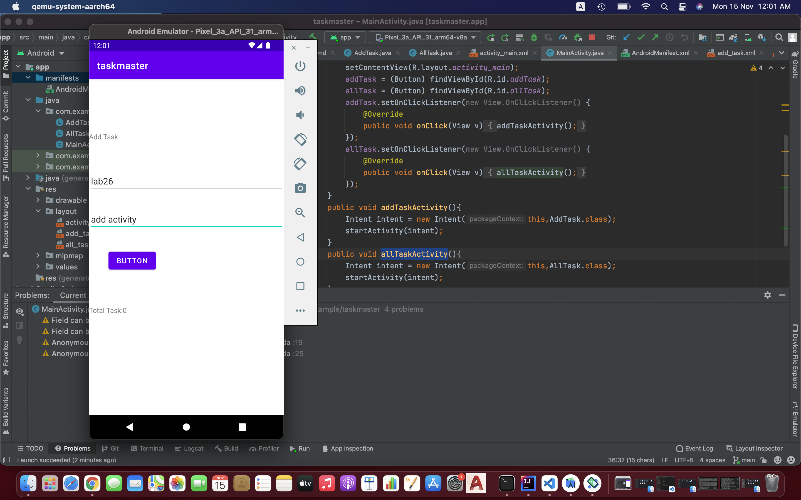
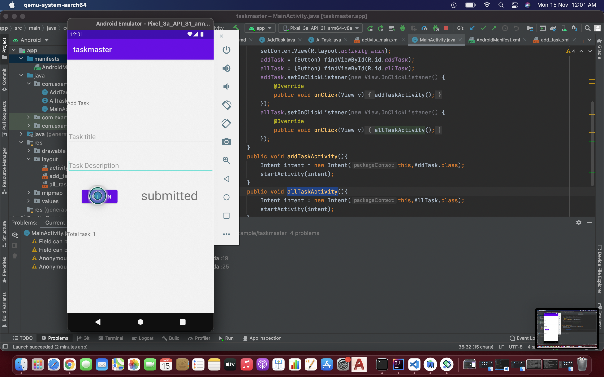
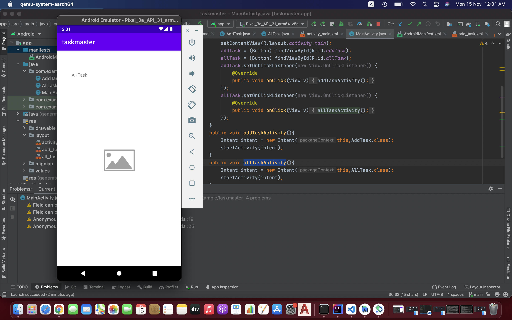
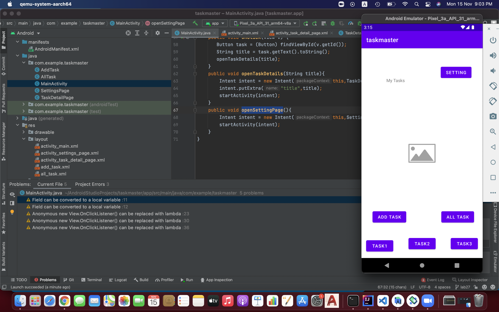
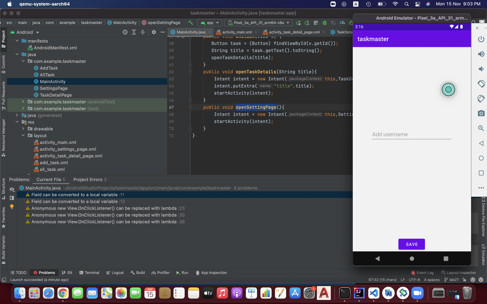
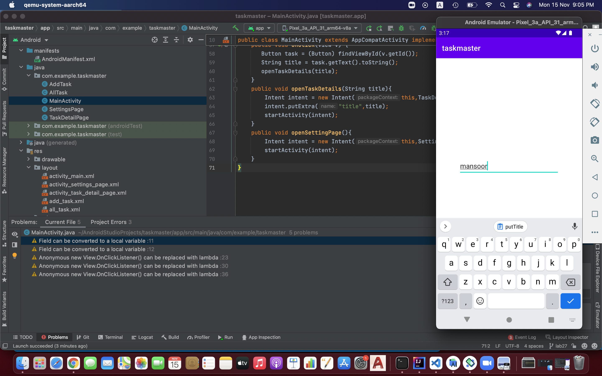
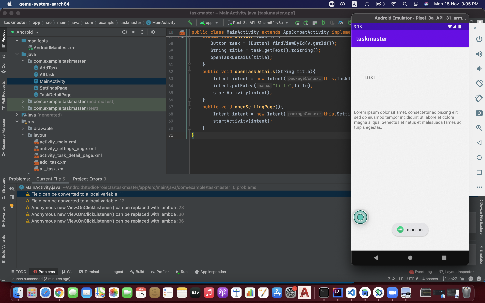
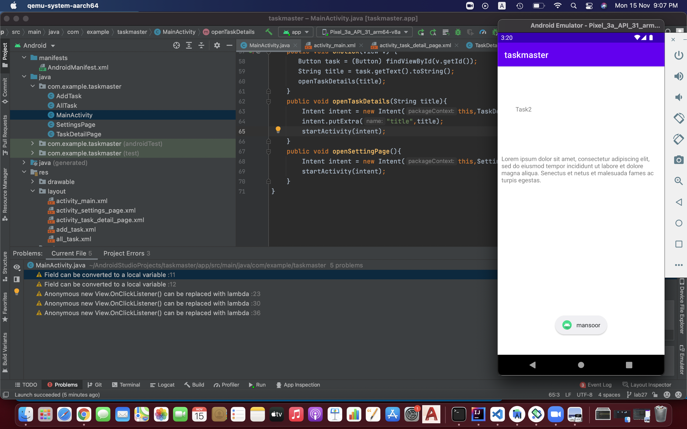

# taskmaster

## android App

## Language -- Java --

## Activity

* MainActivity

* AddTask

* AllTask

* SettingPage

* TaskDetailPage

## Method

* addTaskActivity

will return you to AddTask Activity

* allTaskActivity

will return you to AllTask Activity

* openTaskDetails

will return you to TaskDetails Activity

* openSettingPage

will return you to SettingPage Activity

* shareUserName

will save username in sharedPreferences with key "userName"

* onResume

will get username from sharedPreferences then shown as toast.

* putTitle
to put the title that pass

## Work lab 26

## Work lab 27

